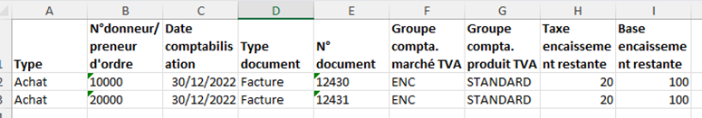

# Extension WanaVAT

Cette extension apporte quelques compléments pour faciliter la gestion de la TVA.

## Identifiant intracommunautaire et adresse
Cet identifiant est désormais essentiel (voir [N° facture et nouvelles mentions obligatoires](https://www.wanamics.fr/n-facture-et-nouvelles-mentions-obligatoires/)).
C’est pourquoi il est placé en tête sur la fiche client et la fiche fournisseur (entre le N° et le Nom).

Puisqu’il permet la détection de doublons, autant en être informé avant d’avoir saisi l’adresse !

Si le **Code pays** n’est pas encore renseigné et que le préfixe du **N° identif. intracomm.** correspond au **Code pays/région Union Européenne** de l’un des **Pays/régions**, le code de celui-ci est repris.

De plus, si le contrôle est activé (voir [N° TVA intracommunautaire](https://www.wanamics.fr/n-tva-intracommunautaire/)), l’adresse (fournie en un seul bloc) sera scindée en **Adresse**, **Code postal** et **Ville** (voir [cette courte vidéo](https://www.youtube.com/watch?v=Tw-rOi6fLfM)).

Outre le gain de temps appréciable, vous éviterez les fautes de frappe (en particulier avec les caractères accentués étrangers).

La règle empirique consiste à rechercher à partir de la fin un code numérique de 3 chiffres minimum supposé faire partie du code postal, ou à défaut, une virgule supposée séparer la ville. Selon le pays, le code postal peut être comporter des lettres (ex : [Codes Postaux de Lettonie – Cybo](https://codes-postaux.cybo.com/lettonie/#listcodes)), ou être en 2 parties (ex : [Codes Postaux de République tchèque – Cybo](https://codes-postaux.cybo.com/r%C3%A9publique-tch%C3%A8que/#listcodes)).

**Cas particuliers**
* Ce service proposé (gratuitement) par l’Union Européenne ne couvre que les 27 pays concernés.
* Pour la France, le nom de la société est préfixé de son statut juridique (SA, SAS…).
Il pourra être effacé (ou déplacé en suffixe) pour préserver le classement alphabétique.
* L’obtention de l’adresse ne semble pas possible pour l’Espagne et l’Allemagne (erreur "Le service de validation TVA VIES n’a pas fourni de détails supplémentaires.").
* Pour la Lituanie (LV) ou la Roumanie (RO), le code postal semble être positionné après la ville et ne permet pas de la dissocier.
* Pour la Grèce, le préfixe utilisé par l’Union Européenne est ‘EL’, alors que la norme ISO (3166-2) lui attribue le code ‘GR’ (également utilisé pour les domaines internet en .gr)

## Contrôle de la TVA sur encaissements
### Contrôle lors de la validation
La TVA sur encaissement reste en attente tant que les écritures d’origine ne sont pas lettrées.

Si elle est déclenchée depuis un document de vente ou d’achat, le montant TTC a été comptabilisé en écritures client ou fournisseur et la TVA sera donc bien comptabilisée lors du lettrage.

En revanche, si elle comptabilisée via une feuille de saisie, il reste possible de comptabiliser de la TVA sur encaissement sans contrepartie à un compte de tiers (en passant directement par le compte bancaire par exemple) et restera alors en TVA en attente.

Un contrôle a donc été ajouté pour exiger un compte client ou fournisseur en cas de TVA sur encaissements.

### Cadrage de la TVA en attente
La TVA en attente devrait correspondre aux écritures non lettrées.

Le traitement **TVA en attente**, extrait (au format .xlsx) le détail des écritures TVA permettant de justifier la TVA en attente à une date donnée.

Un tableau croisé dynamique par **Groupe compta. marché TVA** et **Groupe compta. produit TVA** doit permettre de vérifier le cadrage avec la comptabilité générale (selon les **Paramètres comptabilisation TVA**, ces écritures peuvent concerner plusieurs comptes généraux et/ou plusieurs taux).

En cas d’écart, il faudra vérifier qu’aucune écriture n’a été passée directement sur les comptes de TVA en attente (ce qui n’arrivera pas si **Imputation directe** n’est pas autorisée sur les comptes de TVA).